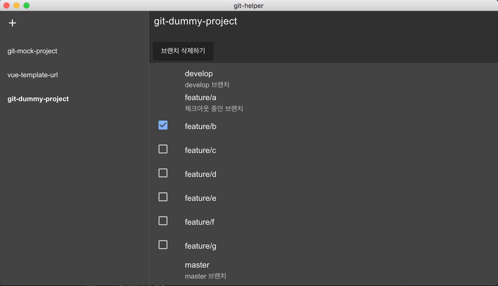

# git-helper

> Git util program



현재 기능

- Git 프로젝트 다중 브랜치 삭제 기능

개발 예정

- gitflow 를 통한 release 브랜치 생성시 커스텀 스크립트 실행

#### Build Setup

```bash
# install dependencies
npm install

# serve with hot reload at localhost:9080
npm run dev

# build electron application for production
npm run build

# run unit & end-to-end tests
npm test


# lint all JS/Vue component files in `src/`
npm run lint
```

---
